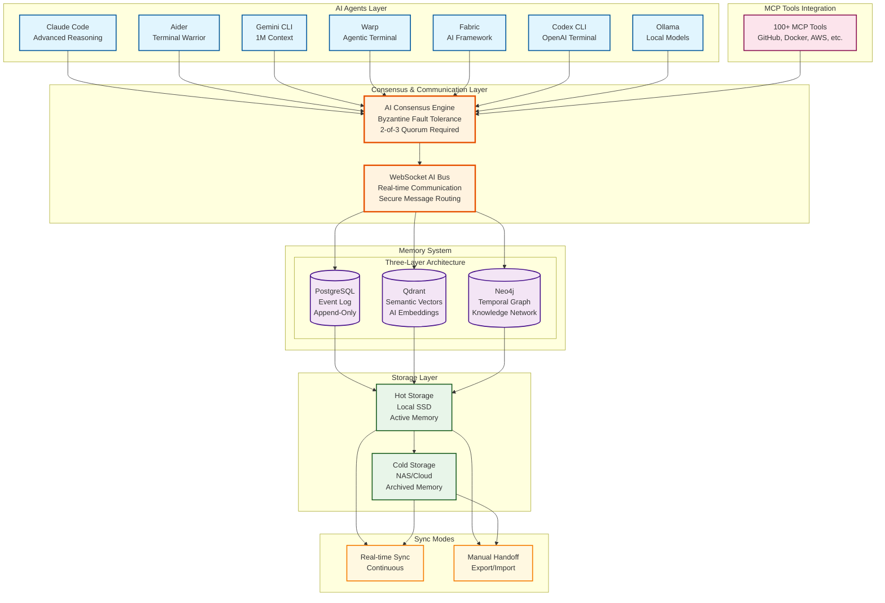
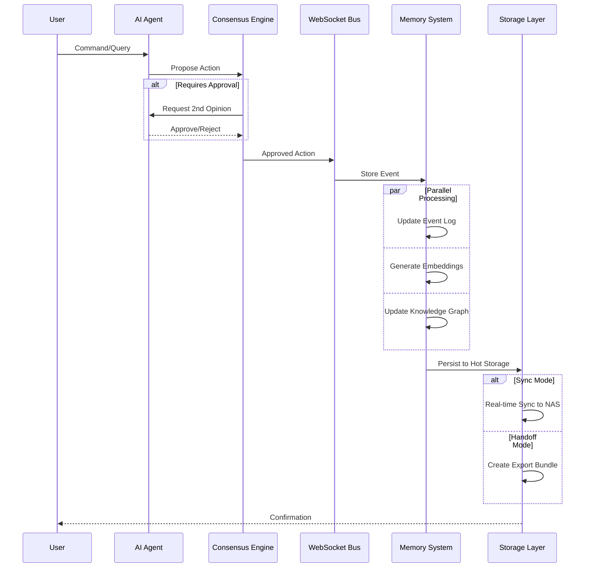
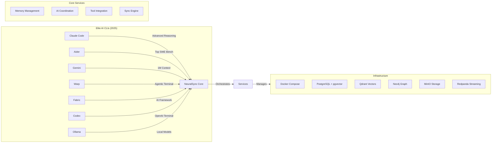
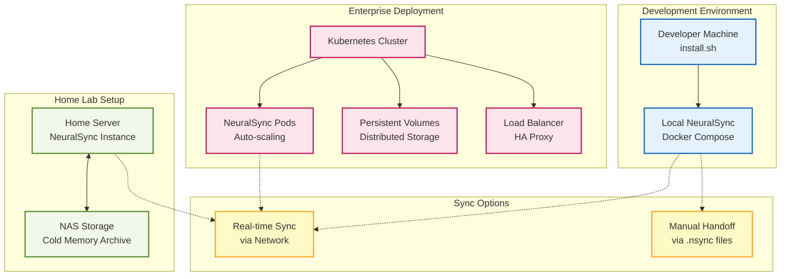
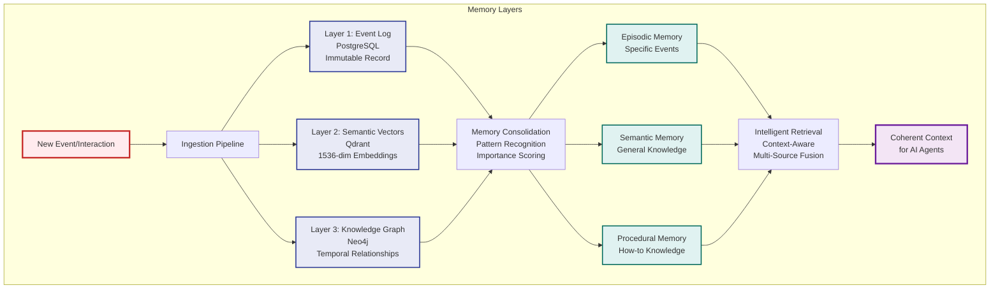

# NeuralSync Architecture

## System Architecture Diagram

```mermaid
graph TB
    subgraph "AI Agents Layer"
        Claude[Claude Code<br/>Advanced Reasoning]
        Aider[Aider<br/>Terminal Warrior]
        Gemini[Gemini CLI<br/>1M Context]
        Warp[Warp<br/>Agentic Terminal]
        Fabric[Fabric<br/>AI Framework]
        Codex[Codex CLI<br/>OpenAI Terminal]
        Ollama[Ollama<br/>Local Models]
    end

    subgraph "MCP Tools Integration"
        MCP[100+ MCP Tools<br/>GitHub, Docker, AWS, etc.]
    end

    subgraph "Consensus & Communication Layer"
        Consensus[AI Consensus Engine<br/>Byzantine Fault Tolerance<br/>2-of-3 Quorum Required]
        Bus[WebSocket AI Bus<br/>Real-time Communication<br/>Secure Message Routing]
    end

    subgraph "Memory System"
        subgraph "Three-Layer Architecture"
            EventLog[(PostgreSQL<br/>Event Log<br/>Append-Only)]
            Vectors[(Qdrant<br/>Semantic Vectors<br/>AI Embeddings)]
            Graph[(Neo4j<br/>Temporal Graph<br/>Knowledge Network)]
        end
    end

    subgraph "Storage Layer"
        Hot[Hot Storage<br/>Local SSD<br/>Active Memory]
        Cold[Cold Storage<br/>NAS/Cloud<br/>Archived Memory]
    end

    subgraph "Sync Modes"
        RealTime[Real-time Sync<br/>Continuous]
        Handoff[Manual Handoff<br/>Export/Import]
    end

    %% Connections
    Claude --> Consensus
    Aider --> Consensus
    Gemini --> Consensus
    Warp --> Consensus
    Fabric --> Consensus
    Codex --> Consensus
    Ollama --> Consensus
    
    MCP --> Consensus
    
    Consensus --> Bus
    Bus --> EventLog
    Bus --> Vectors
    Bus --> Graph
    
    EventLog --> Hot
    Vectors --> Hot
    Graph --> Hot
    
    Hot --> Cold
    Hot --> RealTime
    Hot --> Handoff
    
    Cold --> RealTime
    Cold --> Handoff

    classDef aiAgent fill:#e1f5fe,stroke:#01579b,stroke-width:2px
    classDef consensus fill:#fff3e0,stroke:#e65100,stroke-width:3px
    classDef memory fill:#f3e5f5,stroke:#4a148c,stroke-width:2px
    classDef storage fill:#e8f5e9,stroke:#1b5e20,stroke-width:2px
    classDef sync fill:#fff8e1,stroke:#f57c00,stroke-width:2px
    classDef tools fill:#fce4ec,stroke:#880e4f,stroke-width:2px

    class Claude,Aider,Gemini,Warp,Fabric,Codex,Ollama aiAgent
    class Consensus,Bus consensus
    class EventLog,Vectors,Graph memory
    class Hot,Cold storage
    class RealTime,Handoff sync
    class MCP tools
```

## Data Flow Diagram

```mermaid
sequenceDiagram
    participant User
    participant AI as AI Agent
    participant Consensus as Consensus Engine
    participant Bus as WebSocket Bus
    participant Memory as Memory System
    participant Storage as Storage Layer

    User->>AI: Command/Query
    AI->>Consensus: Propose Action
    
    alt Requires Approval
        Consensus->>AI: Request 2nd Opinion
        AI-->>Consensus: Approve/Reject
    end
    
    Consensus->>Bus: Approved Action
    Bus->>Memory: Store Event
    
    par Parallel Processing
        Memory->>Memory: Update Event Log
        and
        Memory->>Memory: Generate Embeddings
        and
        Memory->>Memory: Update Knowledge Graph
    end
    
    Memory->>Storage: Persist to Hot Storage
    
    alt Sync Mode
        Storage->>Storage: Real-time Sync to NAS
    else Handoff Mode
        Storage->>Storage: Create Export Bundle
    end
    
    Storage-->>User: Confirmation
```

## Component Details

```mermaid
flowchart LR
    subgraph "Elite AI CLIs (2025)"
        A1[Claude Code] --> |Advanced Reasoning| Core
        A2[Aider] --> |Top SWE Bench| Core
        A3[Gemini] --> |1M Context| Core
        A4[Warp] --> |Agentic Terminal| Core
        A5[Fabric] --> |AI Framework| Core
        A6[Codex] --> |OpenAI Terminal| Core
        A7[Ollama] --> |Local Models| Core
    end
    
    Core[NeuralSync Core]
    
    Core --> |Orchestrates| Services
    
    subgraph "Core Services"
        S1[Memory Management]
        S2[AI Coordination]
        S3[Tool Integration]
        S4[Sync Engine]
    end
    
    Services --> |Manages| Infrastructure
    
    subgraph "Infrastructure"
        I1[Docker Compose]
        I2[PostgreSQL + pgvector]
        I3[Qdrant Vectors]
        I4[Neo4j Graph]
        I5[MinIO Storage]
        I6[Redpanda Streaming]
    end
```

## Deployment Architecture

```mermaid
graph TD
    subgraph "Development Environment"
        Dev[Developer Machine<br/>install.sh]
        Dev --> Local[Local NeuralSync<br/>Docker Compose]
    end
    
    subgraph "Home Lab Setup"
        Home[Home Server<br/>NeuralSync Instance]
        NAS[NAS Storage<br/>Cold Memory Archive]
        Home <--> NAS
    end
    
    subgraph "Enterprise Deployment"
        K8s[Kubernetes Cluster]
        K8s --> Pods[NeuralSync Pods<br/>Auto-scaling]
        K8s --> PV[Persistent Volumes<br/>Distributed Storage]
        K8s --> LB[Load Balancer<br/>HA Proxy]
    end
    
    subgraph "Sync Options"
        RT[Real-time Sync<br/>via Network]
        HO[Manual Handoff<br/>via .nsync files]
    end
    
    Local -.-> RT
    Local -.-> HO
    Home -.-> RT
    Pods -.-> RT
    
    classDef dev fill:#e3f2fd,stroke:#1565c0,stroke-width:2px
    classDef home fill:#f1f8e9,stroke:#558b2f,stroke-width:2px
    classDef enterprise fill:#fce4ec,stroke:#c2185b,stroke-width:2px
    classDef sync fill:#fff9c4,stroke:#f9a825,stroke-width:2px
    
    class Dev,Local dev
    class Home,NAS home
    class K8s,Pods,PV,LB enterprise
    class RT,HO sync
```

## Memory Architecture Detail

```mermaid
graph TB
    subgraph "Memory Layers"
        Input[New Event/Interaction]
        
        Input --> Ingest[Ingestion Pipeline]
        
        Ingest --> L1[Layer 1: Event Log<br/>PostgreSQL<br/>Immutable Record]
        Ingest --> L2[Layer 2: Semantic Vectors<br/>Qdrant<br/>1536-dim Embeddings]
        Ingest --> L3[Layer 3: Knowledge Graph<br/>Neo4j<br/>Temporal Relationships]
        
        L1 --> Consolidate[Memory Consolidation<br/>Pattern Recognition<br/>Importance Scoring]
        L2 --> Consolidate
        L3 --> Consolidate
        
        Consolidate --> Episodic[Episodic Memory<br/>Specific Events]
        Consolidate --> Semantic[Semantic Memory<br/>General Knowledge]
        Consolidate --> Procedural[Procedural Memory<br/>How-to Knowledge]
        
        Episodic --> Retrieval[Intelligent Retrieval<br/>Context-Aware<br/>Multi-Source Fusion]
        Semantic --> Retrieval
        Procedural --> Retrieval
        
        Retrieval --> Output[Coherent Context<br/>for AI Agents]
    end
    
    classDef input fill:#ffebee,stroke:#c62828,stroke-width:3px
    classDef layer fill:#e8eaf6,stroke:#283593,stroke-width:2px
    classDef memory fill:#e0f2f1,stroke:#00695c,stroke-width:2px
    classDef output fill:#f3e5f5,stroke:#6a1b9a,stroke-width:3px
    
    class Input input
    class L1,L2,L3 layer
    class Episodic,Semantic,Procedural memory
    class Output output
```